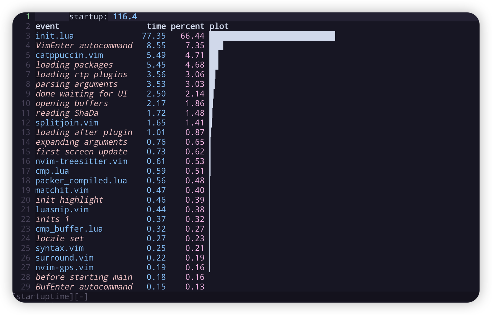

# Nvim 

My neovim config is inspired by [LunarVim/Neovim-from-scratch](https://github.com/LunarVim/Neovim-from-scratch) repository.

Configuration tree:
```shell
.
├── init.lua
├── lua
│   ├── core
│   │   ├── autocommands.lua    # autocommands configuration
│   │   ├── gvarible.lua        # global varible set
│   │   ├── keymaps.lua         # vim-builtin keymap set
│   │   └── options.lua         # vim option set
│   ├── modules                 # plugins configuration
│   └── plugin                  # plugin manager
├── my-snippets                 # customizer snippets
└── plugin                      # compiled packer location
```

## Install 

Make sure to remove or move your current `nvim` directory.

**IMPORTANT** Configuration based on neovim v0.6.0. 

```shell
git clone https://github.com/Rlyown/nvim.git ~/.config/nvim
```

Install the follow dependencies:

* On MacOS

```shell
# Required
brew install ripgrep fd fortune

# Optional for plugins support
brew install llvm lazygit bear clang-format stylua black shfmt
go install github.com/klauspost/asmfmt/cmd/asmfmt@latest
go install github.com/go-delve/delve/cmd/dlv@latest

```

​	*Nerd Fonts* is needed to show icons. And don't forget to change your terminal fonts.

```shell
cd ~/Library/Fonts && curl -fLo "Droid Sans Mono for Powerline Nerd Font Complete.otf" https://github.com/ryanoasis/nerd-fonts/raw/master/patched-fonts/DroidSansMono/complete/Droid%20Sans%20Mono%20Nerd%20Font%20Complete.otf
```

Then run `nvim` and wait for the plugins to be installed.

## Check Health 

Run `nvim` and type the following:
```
:checkhealth
```

You can see plugins' diagnose problems with your configuration or environment.

## Keymaps 

Leader key is comma(`,`) key.

| Plugin          | Mode             | Key               | Description                                                  |
| --------------- | ---------------- | ----------------- | ------------------------------------------------------------ |
| Vim-builtin     | normal           | `<C-h>`           | move left window                                             |
| Vim-builtin     | normal           | `<C-l>`           | move right window                                            |
| Vim-builtin     | normal           | `<C-k>`           | move up window                                               |
| Vim-builtin     | normal           | `<C-j>`           | move down window                                             |
| Vim-builtin     | normal           | `<C-n>`           | next buffer                                                  |
| Vim-builtin     | normal           | `<C-p>`           | prev buffer                                                  |
| Vim-builtin     | normal           | `gt`              | next tab                                                     |
| Vim-builtin     | normal           | `gT`              | prev tab                                                     |
| Vim-builtin     | normal           | `jk`              | same as `<esc>`                                              |
| Vim-builtin     | normal           | `gj`              | move text down                                               |
| Vim-builtin     | normal           | `gk`              | move text up                                                 |
| Vim-builtin     | visual           | `gT`              | prev tab                                                     |
| Vim-builtin     | visual           | `J`               | move text down                                               |
| Vim-builtin     | visual           | `K`               | move text up                                                 |
| Vim-builtin     | visual           | `p`               | paste and replace                                            |
| Vim-builtin     | visual-block     | `J`               | move text down                                               |
| Vim-builtin     | visual-block     | `K`               | move text up                                                 |
| LSP             | normal           | `ga`              | code action                                                  |
| LSP             | normal           | `gD`              | goto declaration                                             |
| LSP             | normal           | `gd`              | goto definition                                              |
| LSP             | normal           | `K`               | hover                                                        |
| LSP             | normal           | `gi`              | goto implementation                                          |
| LSP             | normal           | `<C-k>`           | signature help                                               |
| LSP             | normal           | `gr`              | references                                                   |
| LSP             | normal           | `[d`              | goto prev                                                    |
| LSP             | normal           | `]d`              | goto declaration                                             |
| LSP             | normal           | `gl`              | show current diagnostic                                      |
| LSP             | normal           | `<leader>q`       | show diagnostic list                                         |
| which-key       | normal           | `<leader>`        | show shortcut binding to `<leader>`                          |
| which-key       | normal           | `'`               | show marks                                                   |
| which-key       | normal           | `"`               | show Registers                                               |
| which-key       | insert           | `<C-r>`           | show Registers                                               |
| which-key       | map-view         | `<C-u>`           | scroll up                                                    |
| which-key       | map-view         | `<C-d>`           | scroll down                                                  |
| which-key       | map-view         | `<bs>`            | go up one level                                              |
| which-key       | map-view         | `<esc>`           | cancel and close                                             |
| nvim-cmp        | cmp-view         | `<C-k>`/`<S-Tab>` | select prev item                                             |
| nvim-cmp        | cmp-view         | `<C-j>`/`<Tab>`   | select next item                                             |
| nvim-cmp        | cmp-view         | `<C-b>`           | scroll docs up                                               |
| nvim-cmp        | cmp-view         | `<C-f>`           | scroll docs down                                             |
| nvim-cmp        | cmp-view         | `<C-space>`       | invoke complete                                              |
| nvim-cmp        | cmp-view         | `<C-y>`           | disable                                                      |
| nvim-cmp        | cmp-view         | `<C-e>`           | close                                                        |
| nvim-cmp        | cmp-view         | `<CR>`            | comfirm                                                      |
| luasnip         | snip             | `<Tab>`           | expand or jump next                                          |
| luasnip         | snip             | `<S-Tab>`         | jump prev                                                    |
| Comment.nvim    | normal           | `gcc`             | line comment                                                 |
| Comment.nvim    | normal           | `gbc`             | block comment                                                |
| Comment.nvim    | visual           | `gc`              | line comment                                                 |
| Comment.nvim    | visual           | `gb`              | block comment                                                |
| nvim-tree       | tree-view        | `?`               | show help                                                    |
| Project.nvim    | telescope-normal | `f`               | find project files                                           |
| Project.nvim    | telescope-normal | `b`               | browse project files                                         |
| Project.nvim    | telescope-normal | `d`               | delete project                                               |
| Project.nvim    | telescope-normal | `s`               | search in project files                                      |
| Project.nvim    | telescope-normal | `r`               | recent project files                                         |
| Project.nvim    | telescope-normal | `w`               | change working directory                                     |
| Project.nvim    | telescope-insert | `<C-f>`           | find project files                                           |
| Project.nvim    | telescope-insert | `<C-b>`           | browse project files                                         |
| Project.nvim    | telescope-insert | `<C-d>`           | delete project                                               |
| Project.nvim    | telescope-insert | `<C-s>`           | search in project files                                      |
| Project.nvim    | telescope-insert | `<C-r>`           | recent project files                                         |
| Project.nvim    | telescope-insert | `<C-w>`           | change working directory                                     |
| Telescope       | telescope-normal | `?`               | which key                                                    |
| Telescope       | telescope-insert | `<C-_>`           | which key                                                    |
| undotree        | undotree-view    | `?`               | show help                                                    |
| vim-surround    | normal           | `cs<old><new>`    | change old surround char to new                              |
| vim-surround    | normal           | `cst<new>`        | change full circle to new                                    |
| vim-surround    | normal           | `ds<chr>`         | delete surround char                                         |
| vim-surround    | normal           | `ys<motion><chr>` | add surround to a motion                                     |
| vim-surround    | visual           | `S<chr>`          | add surround char to visual selection                        |
| vim-startuptime | startup-view     | `K`               | get additional information                                   |
| vim-startuptime | startup-view     | `gf`              | load the corresponding file in a new split                   |
| splitjoin       | normal           | `gS`              | split a one-liner into multiple lines                        |
| splitjoin       | normal           | `gJ`              | (with the cursor on the first line of a block) to join a block into a single-line statement. |

## Plugins

See `lua/plugin/plugins.lua`

## Test Startup

```shell
# in neovim command line
:StartupTime
# or in normal mode
<leader><leader>s
```



## Something Useful

* [Everything you need to know to configure neovim using lua](https://vonheikemen.github.io/devlog/tools/configuring-neovim-using-lua/)

* [Getting started using Lua in Neovim](https://github.com/nanotee/nvim-lua-guide)

* [Snippets in Visual Studio Code](https://code.visualstudio.com/docs/editor/userdefinedsnippets)
