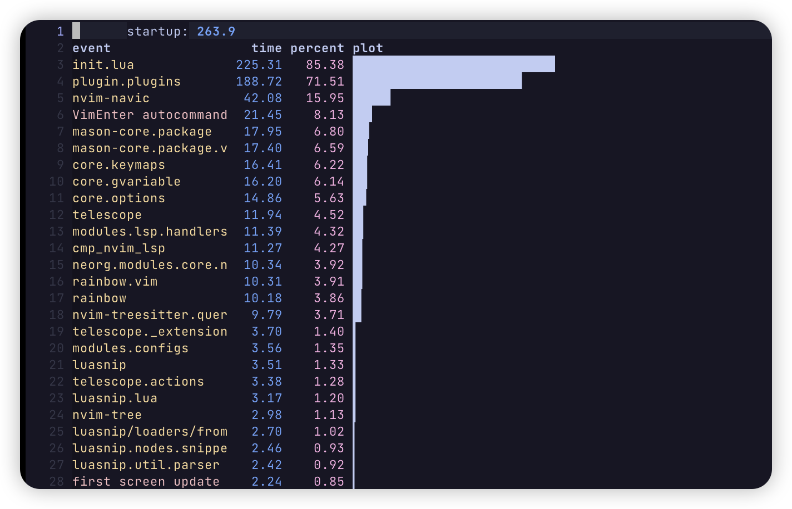
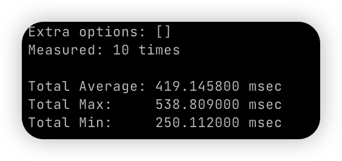

# Nvim

My neovim config is inspired by [LunarVim/Neovim-from-scratch](https://github.com/LunarVim/Neovim-from-scratch) repository.

- ## [Nvim](#nvim)
  - [Quick start](#quick-start)
  - [Install](#install)
  - [Check Health](#check-health)
  - [Tmux Integration](#tmux-integration)
  - [Latex Integration](#latex-integration)
  - [Different Input Method](#Different-Input-Method)
  - [Keymaps](#keymaps)
  - [Plugins](#plugins)
  - [Test Startup](#test-startup)
  - [Screenshot](#screenshot)
  - [Something Useful](#something-useful)

Configuration tree:

```shell
.
├── init.lua
├── lua
│   ├── core
│   │   ├── autocommands.lua        # autocommands configuration
│   │   ├── gvariable.lua           # global variable set(the last one be called)
│   │   ├── gfunc.lua               # global function definition
│   │   ├── keymaps.lua             # vim-builtin keymap set
│   │   └── options.lua             # vim option set
│   ├── modules                     # plugins configuration
│   │   └── configs.lua             # expose setup function
│   └── plugin                      # plugin manager
├── snippets                        # customizer snippets
├── plugin                          # compiled plugin file location
│   └── lazy-lock.json              # plugins' version control file
├── spell                           # customizer dictionary
└── templates                       # store some template file
```

This configuration mainly focus on programming with `C/Cpp`, `Golang`, `Rust` and `Python`.

## Quick Start

**WARNING**: The script uses the `Homebrew` to install dependencies. Please read it carefully before running it.

```shell
$ git clone https://github.com/Rlyown/nvim.git ~/.config/nvim
$ cd ~/.config/nvim
$ ./install.sh -i
$ nvim
```

## Install

Make sure to remove or move your current `nvim` directory.

**IMPORTANT** Configuration based on neovim v0.9.2.

```shell
$ git clone https://github.com/Rlyown/nvim.git ~/.config/nvim
```

**Requirements**

- [Neovim](https://neovim.io/)
- [Lua](https://www.lua.org/) (for neovim runtime)
- [Homebrew](https://brew.sh/) (for packages' installation in MacOS or Linux, **but only for single user**)
- [Rust](https://www.rust-lang.org/tools/install) (for some installations of dependencies)
- [Python3](https://www.python.org/downloads/) with [pip](https://pip.pypa.io/en/stable/installation/) and `venv` (for some plugins)
- [Nodejs](https://github.com/nodesource/distributions) 16 (for copilot.vim and some installations of dependencies)
- [Yarn](https://classic.yarnpkg.com/lang/en/docs/install) (for markdown preview plugin)
- [Llvm](https://github.com/llvm/llvm-project) (for debug tool)
- [Golang](https://go.dev/doc/install) 1.18 or higher (for some installations of dependencies and developments)

**Install with following Steps**:

**NOTE**: For the Linux platform, the `Homebrew` is not necessary, you can install these packages through the tools provided by your current Linux distribution manually.

**First Step**. Install the necessary packages, including environments in requirements.

- <details><summary>On MacOS</summary>
  <p>

  ```shell
  # Runtime
  $ brew install neovim go python3 node@16 rust llvm lua yarn npm

  # Packages
  $ brew install ripgrep fd lazygit gnu-sed

  # Optional Packages
  $ brew install fortune bear llvm

  # If you want delete file to trash bin directory by nvim-tree
  $ brew install trash
  ```

  _Nerd Fonts_ is needed to show icons. You can choose your favorite font or find icons in the [https://www.nerdfonts.com](https://www.nerdfonts.com).

  ```shell
  # Other nice fonts: Hack, Fira Code, Meslo
  $ brew tap homebrew/cask-fonts
  $ brew install --cask font-jetbrains-mono-nerd-font
  ```

  _Note_: Don't forget to change your terminal fonts.

  </p>
  </details>

- <details><summary>On Linux</summary>
  <p>

  **NOTE**:

  ```shell
  # Runtime
  $ brew install neovim go python3 node@16 rust llvm lua yarn npm

  # Packages
  $ brew install ripgrep fd lazygit exa bat

  # Optional Packages
  $ brew install fortune bear
  ```

  _Nerd Fonts_ is needed to show icons. You can choose your favorite font or find icons in the [https://www.nerdfonts.com](https://www.nerdfonts.com).

  ```shell
  # Other nice fonts: Hack, Fira Code, Meslo
  $ mkdir -p ~/.local/share/fonts
  $ cd ~/.local/share/fonts && curl -fLo "JetBrains Mono NL Regular Nerd Font Complete.ttf" https://github.com/ryanoasis/nerd-fonts/raw/master/patched-fonts/JetBrainsMono/Ligatures/Regular/JetBrainsMonoNerdFontMono-Regular.ttf
  ```

  _Note_: Don't forget to change your terminal fonts.

  </p>
  </details>

**Optional Step**. To set neovim as default editor, you can add these to `~/.bashrc` or `~/.zshrc`:

```shell
export VISUAL="nvim"
export EDITOR="nvim"
```

**Final Step**. Run `nvim` and wait for the plugins to be installed.

```shell
# First time to run nvim
$ nvim
# Or Synchronize all plugins manually
$ nvim --headless "+Lazy! sync" +qa
# Or Synchronize all plugins with specific version
$ nvim --headless "+Lazy! restore" +qa

# create neorg default directory
$ mkdir -p ~/.local/state/nvim/neorg-notes/work
```

Congratulations, now start enjoying the powerful neovim!

## Check Health

Run `nvim` and type the following:

```
:checkhealth
```

You can see plugins' diagnose problems with your configuration or environment.

## Tmux Integration

If you want to have a better experience with tmux, you can add the following bindings to your `~/.tmux.conf`.

```
# To enable cycle-free navigation beyond nvim
is_vim="ps -o state= -o comm= -t '#{pane_tty}' | grep -iqE '^[^TXZ ]+ +(\\S+\\/)?g?(view|n?vim?x?)(diff)?$'"

bind-key -n 'C-h' if-shell "$is_vim" 'send-keys C-h' { if -F '#{pane_at_left}' '' 'select-pane -L' }
bind-key -n 'C-j' if-shell "$is_vim" 'send-keys C-j' { if -F '#{pane_at_bottom}' '' 'select-pane -D' }
bind-key -n 'C-k' if-shell "$is_vim" 'send-keys C-k' { if -F '#{pane_at_top}' '' 'select-pane -U' }
bind-key -n 'C-l' if-shell "$is_vim" 'send-keys C-l' { if -F '#{pane_at_right}' '' 'select-pane -R' }

bind-key -T copy-mode-vi 'C-h' if -F '#{pane_at_left}' '' 'select-pane -L'
bind-key -T copy-mode-vi 'C-j' if -F '#{pane_at_bottom}' '' 'select-pane -D'
bind-key -T copy-mode-vi 'C-k' if -F '#{pane_at_top}' '' 'select-pane -U'
bind-key -T copy-mode-vi 'C-l' if -F '#{pane_at_right}' '' 'select-pane -R'

# To resize the window
is_vim="ps -o state= -o comm= -t '#{pane_tty}' | grep -iqE '^[^TXZ ]+ +(\\S+\\/)?g?(view|n?vim?x?)(diff)?$'"

bind -n 'M-h' if-shell "$is_vim" 'send-keys M-h' 'resize-pane -L 1'
bind -n 'M-j' if-shell "$is_vim" 'send-keys M-j' 'resize-pane -D 1'
bind -n 'M-k' if-shell "$is_vim" 'send-keys M-k' 'resize-pane -U 1'
bind -n 'M-l' if-shell "$is_vim" 'send-keys M-l' 'resize-pane -R 1'

bind-key -T copy-mode-vi M-h resize-pane -L 1
bind-key -T copy-mode-vi M-j resize-pane -D 1
bind-key -T copy-mode-vi M-k resize-pane -U 1
bind-key -T copy-mode-vi M-l resize-pane -R 1
```

For more detail refer to [usage of tmux.nvim](https://github.com/aserowy/tmux.nvim#usage).

## Latex Integration

If you want to use latex, you can install [Skim](https://skim-app.sourceforge.io/) and [VimTeX](https://github.com/lervag/vimtex).
VimTex has been installed by default. It only will be activated when executable `latexmk` be detected.
You can install Skim with `brew install --cask skim`, and install Tex Live with `brew install --cask mactex-no-gui` in MacOS.

For more detail refer to [Setting Up a PDF Reader for Writing LaTeX with Vim](https://www.ejmastnak.com/tutorials/vim-latex/pdf-reader/).

## Different Input Method

In my configuration, [ZFVimIM](https://github.com/ZSaberLv0/ZFVimIM) has been installed by default to support Chinese. You can just press `;;` to switch between English and Chinese without changing input method on your computer or remote server.

For more detail or other languages refer to [ZFVimIM](https://github.com/ZSaberLv0/ZFVimIM).

## Keymaps

Leader key is comma(`,`) key. You can just press `<leader>` or `<leader><leader>` to see most keybindings.

| Plugin          | Mode             | Key                     | Description                                                                                  |
| --------------- | ---------------- | ----------------------- | -------------------------------------------------------------------------------------------- |
| Vim-builtin     | normal           | `<C-h>`                 | move left window                                                                             |
| Vim-builtin     | normal           | `<C-l>`                 | move right window                                                                            |
| Vim-builtin     | normal           | `<C-k>`                 | move up window                                                                               |
| Vim-builtin     | normal           | `<C-j>`                 | move down window                                                                             |
| Vim-builtin     | normal           | `<C-n>`/`L`             | next buffer                                                                                  |
| Vim-builtin     | normal           | `<C-p>`/`H`             | prev buffer                                                                                  |
| Vim-builtin     | normal           | `<leader><leader>lt`    | copy `.clang-tidy` from template directory to your current location                          |
| Vim-builtin     | normal           | `<leader><leader>lf`    | copy `.clang-format` from template directory to your current location                        |
| Vim-builtin     | normal           | `gt`                    | next tab                                                                                     |
| Vim-builtin     | normal           | `gT`                    | prev tab                                                                                     |
| Vim-builtin     | normal           | `jk`                    | same as `<esc>`                                                                              |
| Vim-builtin     | normal           | `gj`                    | move text down                                                                               |
| Vim-builtin     | normal           | `gk`                    | move text up                                                                                 |
| Vim-builtin     | visual           | `gT`                    | prev tab                                                                                     |
| Vim-builtin     | visual           | `J`                     | move text down                                                                               |
| Vim-builtin     | visual           | `K`                     | move text up                                                                                 |
| Vim-builtin     | visual           | `p`                     | paste and replace                                                                            |
| Vim-builtin     | visual-block     | `J`                     | move text down                                                                               |
| Vim-builtin     | visual-block     | `K`                     | move text up                                                                                 |
| LSP             | normal           | `ga`                    | code action                                                                                  |
| LSP             | normal           | `gD`                    | goto declaration                                                                             |
| LSP             | normal           | `gd`                    | goto definition                                                                              |
| LSP             | normal           | `K`                     | hover                                                                                        |
| LSP             | normal           | `gi`                    | goto implementation                                                                          |
| LSP             | normal           | `gh`                    | signature help                                                                               |
| LSP             | normal           | `gr`                    | references                                                                                   |
| LSP             | normal           | `[d`                    | goto prev                                                                                    |
| LSP             | normal           | `]d`                    | goto declaration                                                                             |
| LSP             | normal           | `gl`                    | show current diagnostic                                                                      |
| LSP             | normal           | `gq`                    | show diagnostic list                                                                         |
| which-key       | normal           | `'`                     | show marks                                                                                   |
| which-key       | normal           | `"`                     | show Registers                                                                               |
| which-key       | insert           | `<C-r>`                 | show Registers                                                                               |
| which-key       | map-view         | `<C-u>`                 | scroll up                                                                                    |
| which-key       | map-view         | `<C-d>`                 | scroll down                                                                                  |
| which-key       | map-view         | `<bs>`                  | go up one level                                                                              |
| which-key       | map-view         | `<esc>`                 | cancel and close                                                                             |
| nvim-cmp        | cmp-view         | `<C-k>`/`<S-Tab>`       | select prev item                                                                             |
| nvim-cmp        | cmp-view         | `<C-j>`/`<Tab>`         | select next item                                                                             |
| nvim-cmp        | cmp-view         | `<C-b>`                 | scroll docs up                                                                               |
| nvim-cmp        | cmp-view         | `<C-f>`                 | scroll docs down                                                                             |
| nvim-cmp        | cmp-view         | `<C-space>`             | invoke complete                                                                              |
| nvim-cmp        | cmp-view         | `<C-y>`                 | disable                                                                                      |
| nvim-cmp        | cmp-view         | `<C-e>`                 | close                                                                                        |
| nvim-cmp        | cmp-view         | `<CR>`                  | comfirm                                                                                      |
| luasnip         | snip             | `<Tab>`                 | expand or jump next                                                                          |
| luasnip         | snip             | `<S-Tab>`               | jump prev                                                                                    |
| Comment.nvim    | normal           | `gcc`                   | line comment                                                                                 |
| Comment.nvim    | normal           | `gbc`                   | block comment                                                                                |
| Comment.nvim    | visual           | `gc`                    | line comment                                                                                 |
| Comment.nvim    | visual           | `gb`                    | block comment                                                                                |
| nvim-tree       | tree-view        | `?`                     | show help                                                                                    |
| Telescope       | telescope-normal | `?`                     | which key                                                                                    |
| Telescope       | telescope-insert | `<C-_>`                 | which key                                                                                    |
| undotree        | undotree-view    | `?`                     | show help                                                                                    |
| vim-surround    | normal           | `cs<old><new>`          | change old surround char to new                                                              |
| vim-surround    | normal           | `cst<new>`              | change full circle to new                                                                    |
| vim-surround    | normal           | `ds<chr>`               | delete surround char                                                                         |
| vim-surround    | normal           | `ys<motion><chr>`       | add surround to a motion                                                                     |
| vim-surround    | visual           | `S<chr>`                | add surround char to visual selection                                                        |
| vim-startuptime | startup-view     | `K`                     | get additional information                                                                   |
| vim-startuptime | startup-view     | `gf`                    | load the corresponding file in a new split                                                   |
| splitjoin       | normal           | `gS`                    | split a one-liner into multiple lines                                                        |
| splitjoin       | normal           | `gJ`                    | (with the cursor on the first line of a block) to join a block into a single-line statement. |
| terminal        | terminal-insert  | `jk`                    | escape terminal insert mode                                                                  |
| terminal        | normal           | `i`                     | go back to terminal insert mode                                                              |
| terminal        | terminal-insert  | `<C-h>`                 | move to left window                                                                          |
| terminal        | terminal-insert  | `<C-j>`                 | move to down window                                                                          |
| terminal        | terminal-insert  | `<C-k>`                 | move to up window                                                                            |
| terminal        | terminal-insert  | `<C-l>`                 | move to right window                                                                         |
| trouble.nvim    | quickfix-view    | `q`                     | close the list                                                                               |
| trouble.nvim    | quickfix-view    | `<esc>`                 | cancel the preview and get back to your last window / buffer / cursor                        |
| trouble.nvim    | quickfix-view    | `<cr>`/`<tab>`          | jump to the diagnostic or open / close folds                                                 |
| trouble.nvim    | quickfix-view    | `<c-x>`                 | open buffer in new split                                                                     |
| trouble.nvim    | quickfix-view    | `<c-v>`                 | open buffer in new vsplit                                                                    |
| trouble.nvim    | quickfix-view    | `<c-t>`                 | open buffer in new tab                                                                       |
| trouble.nvim    | quickfix-view    | `o`                     | jump to the diagnostic and close the list                                                    |
| trouble.nvim    | quickfix-view    | `m`                     | toggle between "workspace" and "document" diagnostics mode                                   |
| trouble.nvim    | quickfix-view    | `P`                     | toggle auto_preview                                                                          |
| trouble.nvim    | quickfix-view    | `K`                     | opens a small popup with the full multiline message                                          |
| trouble.nvim    | quickfix-view    | `p`                     | preview the diagnostic location                                                              |
| trouble.nvim    | quickfix-view    | `zM`/`zm`               | close all folds                                                                              |
| trouble.nvim    | quickfix-view    | `zR`/`zr`               | open all folds                                                                               |
| trouble.nvim    | quickfix-view    | `zA`/`za`               | toggle fold of current file                                                                  |
| trouble.nvim    | quickfix-view    | `k`                     | preview item                                                                                 |
| trouble.nvim    | quickfix-view    | `j`                     | next item                                                                                    |
| nvim-dap        | Normal           | `<leader>d`             | see all the keybindings about debugger                                                       |
| nvim-dap-ui     | dapui-view       | `<cr>`/`<2-LeftMouse`   | expand children                                                                              |
| nvim-dap-ui     | dapui-view       | `o`                     | jump to the location                                                                         |
| nvim-dap-ui     | dapui-view       | `e`                     | edit the value of a variable                                                                 |
| nvim-dap-ui     | dapui-view       | `d`                     | remove the watched expression.                                                               |
| nvim-dap-ui     | dapui-view       | `r`                     | send to REPL                                                                                 |
| nvim-dap-ui     | dapui-view       | `<space>`               | enable/disable the selected breakpoint, or toggle displaying subtle frames                   |
| Nvim-gdb        | buf-normal       | `<space>`               | set/unset breakpoint                                                                         |
| ZFVimIM         | normal/insert    | `;;`                    | enable other language input method. (Only Chinese configured)                                |
| ZFVimIM         | normal/insert    | `;:`                    | switch input db                                                                              |
| ZFVimIM         | insert           | `-`/`+`                 | scroll page                                                                                  |
| ZFVimIM         | insert           | `<space>`/`0-9`/`[`/`]` | choose word (first/position/head/tail)                                                       |
| ZFVimIM         | insert           | `;,`/`;.`               | add or remove user word                                                                      |

If you want to enter a new expression at `DAP Watches`, just enter insert mode and you will see a prompt appear, and press enter to submit. For more details about `dap-ui`, you can click [https://github.com/rcarriga/nvim-dap-ui](https://github.com/rcarriga/nvim-dap-ui).

## Plugins

See details in `lua/plugin/plugins.lua`

## Test Startup

```shell
# in neovim command line
:StartupTime
# or in normal mode
<leader><leader>s
# or just use vim builtin argument on terminal
$ nvim --startuptime startup.log
```



Alternatively, you can use a Go program to measure startup time of vim. [https://github.com/rhysd/vim-startuptime](https://github.com/rhysd/vim-startuptime).

```sh
# Installation
$ go install github.com/rhysd/vim-startuptime@latest
# Usage
$ vim-startuptime -vimpath nvim
```



## Screenshot

**Keybindings Popup**


**Completion**


**DAP Debugger**


## Something Useful

- [Everything you need to know to configure neovim using lua](https://vonheikemen.github.io/devlog/tools/configuring-neovim-using-lua/)

- [Getting started using Lua in Neovim](https://github.com/nanotee/nvim-lua-guide)

- [Snippets in Visual Studio Code](https://code.visualstudio.com/docs/editor/userdefinedsnippets)
