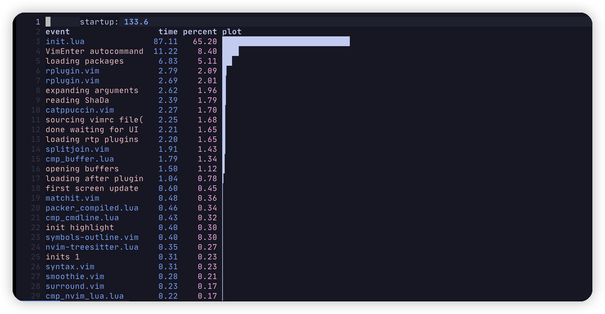
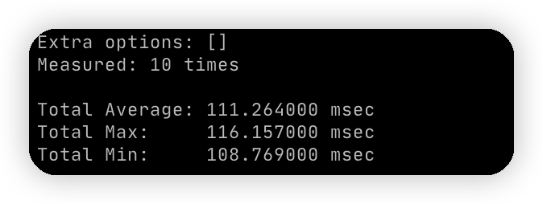
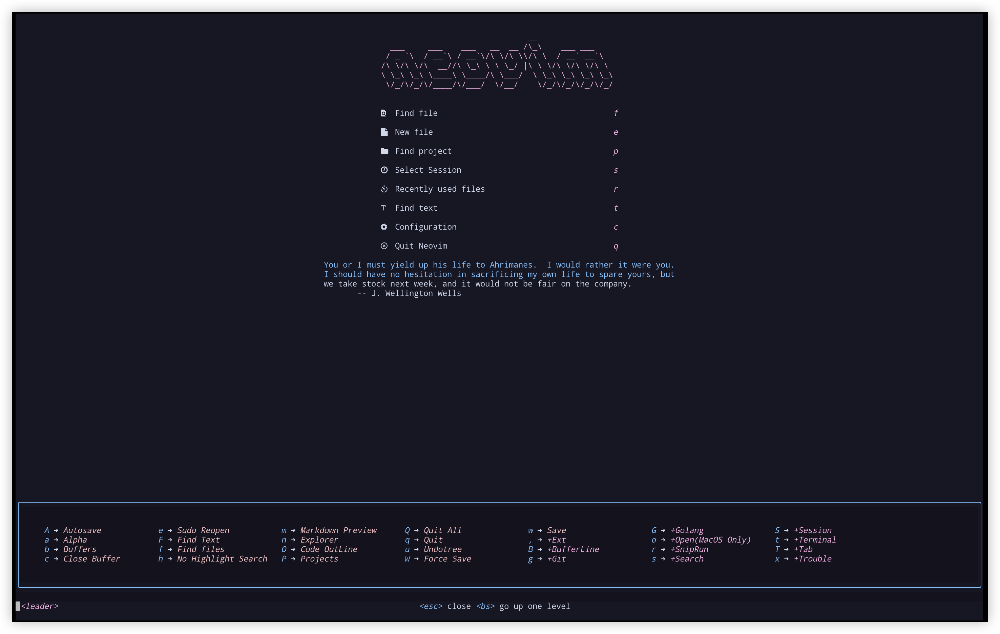
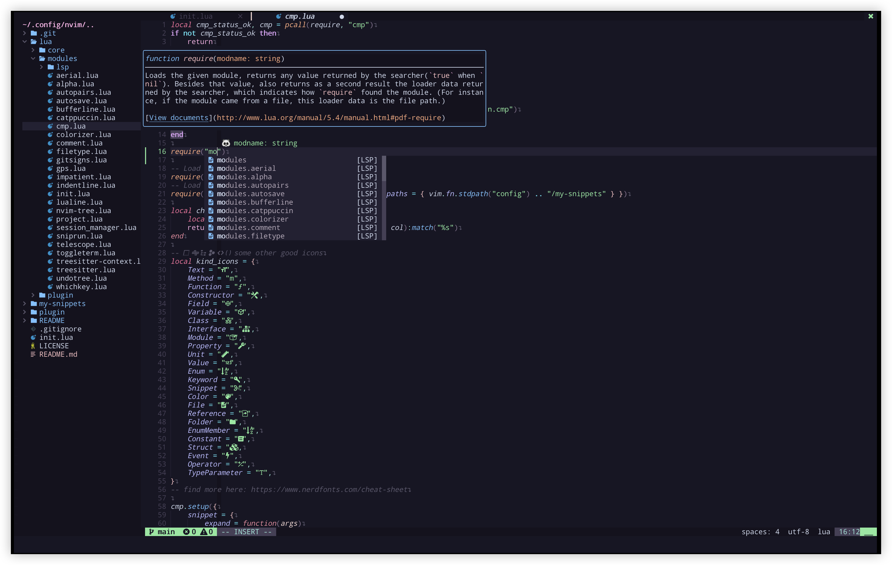
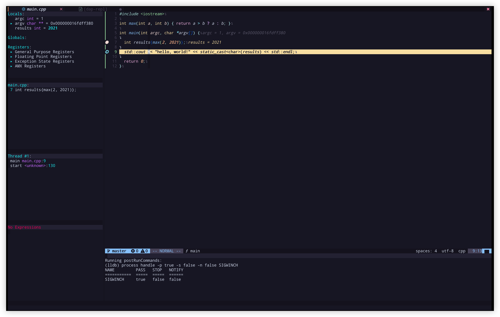

# Nvim 


My neovim config is inspired by [LunarVim/Neovim-from-scratch](https://github.com/LunarVim/Neovim-from-scratch) repository.

* [Nvim](#nvim)
  * [Install](#install)
  * [Check Health](#check-health)
  * [Keymaps](#keymaps)
  * [Plugins](#plugins)
  * [Test Startup](#test-startup)
  * [Screenshot](#screenshot)
  * [Something Useful](#something-useful)

Configuration tree:
```shell
.
├── init.lua
├── lua
│   ├── core
│   │   ├── autocommands.lua    # autocommands configuration
│   │   ├── gvariable.lua       # global variable set(the last one be called)
│   │   ├── keymaps.lua         # vim-builtin keymap set
│   │   └── options.lua         # vim option set
│   ├── modules                 # plugins configuration
│   └── plugin                  # plugin manager
├── my-snippets                 # customizer snippets
├── template                    # store some template file
└── plugin                      # compiled packer location
```

This configuration mainly focus on programming with `C/Cpp`, `Golang`, `Rust` and `Python`. 

## Install 

Make sure to remove or move your current `nvim` directory.

**IMPORTANT** Configuration based on neovim v0.7.0. 

```shell
$ git clone https://github.com/Rlyown/nvim.git ~/.config/nvim
```

Install the follow dependencies:

* On MacOS

    ```shell
    $ brew install neovim ripgrep fd fortune lua sqlite
    
    # Tools for language support
    # neovim-remote is not Required
    $ brew install llvm bear cmake lazygit golang stylua rustup-init shfmt node yarn gnu-sed boost
    
    $ npm install -g neovim
    $ go install github.com/klauspost/asmfmt/cmd/asmfmt@latest
    $ go install github.com/go-delve/delve/cmd/dlv@latest
    $ rustup-init
    
    # Install neovim python support, and python debugger used by dap
    # To avoid multi-version conflicts, 
    # set up a virtual environment to install neovim related libraries.
    # the python path is set in the lua/core/gvariable.lua
    $ conda create -n debugpy python=3.9
    $ conda activate debugpy
    $ pip install pynvim debugpy
    
    # llvm should add to path manually
    # On Apple Sillcon
    $ echo 'export PATH="/opt/homebrew/opt/llvm/bin:$PATH"' >> ~/.zshrc
    
    # If you want delete file to trash bin directory by nvim-tree
    $ brew install trash
    ```

    *Nerd Fonts* is needed to show icons. You can choose your favorite font or find icons in the  [https://www.nerdfonts.com](https://www.nerdfonts.com).

    ```shell
    # Other nice fonts: Hack, Fira Code, Meslo
    $ brew tap homebrew/cask-fonts
    $ brew install --cask font-jetbrains-mono-nerd-font
    ```

    *Note*: Don't forget to change your terminal fonts.

* On Ubuntu 20.04

  * Golang require >= 1.17

  ```shell
  # Install System denpendence
  $ sudo apt-get install software-properties-common curl gnupg git libreadline-dev
  
  # Install Golang
  $ wget https://go.dev/dl/go1.18.linux-amd64.tar.gz 
  $ sudo rm -rf /usr/local/go && sudo tar -C /usr/local -xzf go1.18.linux-amd64.tar.gz
  # If you want to make go-bin-path persistent, write it to your ~/.bashrc
  $ export PATH=/usr/local/go/bin:$HOME/go/bin:$PATH
  
  # Install Rust
  $ curl --proto '=https' --tlsv1.2 -sSf https://sh.rustup.rs | sh
  $ source $HOME/.cargo/env
  
  # Install LLVM
  $ bash -c "$(wget -O - https://apt.llvm.org/llvm.sh)"
  
  # add Node source
  $ curl -fsSL https://deb.nodesource.com/setup_lts.x | sudo -E bash -
  
  # Install neovim
  $ cargo install --git https://github.com/MordechaiHadad/bob.git
  $ bob install v0.7.0
  $ echo 'export PATH=$HOME/.local/share/neovim/bin:$PATH' >> ~/.bashrc
  $ source ~/.bashrc
  $ bob use v0.7.0
  
  # Install main packages
  $ sudo apt update
  $ sudo apt install -y neovim ripgrep fd-find fortune-mod lua5.3
  
  # Tools for language support
  $ sudo apt-get update
  $ sudo apt install -y  bear cmake nodejs gdb yarn python3-pip libsqlite3-dev sqlite3 libboost-all-dev python3-dev
  $ cargo install stylua
  $ sudo npm install -g neovim
  $ go install github.com/jesseduffield/lazygit@latest
  $ go install github.com/klauspost/asmfmt/cmd/asmfmt@latest
  $ go install mvdan.cc/sh/v3/cmd/shfmt@latest
  $ go install github.com/go-delve/delve/cmd/dlv@latest
  
  # Install neovim python support, and python debugger used by dap
  # If want to deal with multi-version conflicts, you can follow the method of MacOS
  $ pip3 install pynvim debugpy
  
  # If you want delete file to trash bin directory by nvim-tree
  $ npm install --global trash-cli
  ```
  
  *Nerd Fonts* is needed to show icons. You can choose your favorite font or find icons in the  [https://www.nerdfonts.com](https://www.nerdfonts.com).
  
  ```shell
  # Other nice fonts: Hack, Fira Code, Meslo
  $ mkdir -p ~/.local/share/fonts
  $ cd ~/.local/share/fonts && curl -fLo "JetBrains Mono NL Regular Nerd Font Complete.ttf" https://github.com/ryanoasis/nerd-fonts/raw/master/patched-fonts/JetBrainsMono/NoLigatures/Regular/complete/JetBrains%20Mono%20NL%20Regular%20Nerd%20Font%20Complete.ttf
  ```
  
  *Note*: Don't forget to change your terminal fonts.

To set neovim as default editor, you can add these to `~/.bashrc` or `~/.zshrc`:

```shell
export VISUAL="nvim"
export EDITOR="nvim"
```

Finally, run `nvim` and wait for the plugins to be installed.

```sh
# First time to run nvim
$ nvim
# Or Synchronize all plugins manually
$ nvim +PackerSync

# cpsm plugin require manual compilation at first time
# cpsm plugin is used for wilder.nvim plugin
$ cd ~/.local/share/nvim/site/pack/packer/start/cpsm && ./install.sh
```

Congratulations, now start enjoying the powerful neovim!

## Check Health 

Run `nvim` and type the following:
```
:checkhealth
```

You can see plugins' diagnose problems with your configuration or environment.

## Keymaps 

Leader key is comma(`,`) key. You can just press `<leader>` or `<leader><leader>` to see most keybindings.

| Plugin          | Mode             | Key                   | Description                                                  |
| --------------- | ---------------- | --------------------- | ------------------------------------------------------------ |
| Vim-builtin     | normal           | `<C-h>`               | move left window                                             |
| Vim-builtin     | normal           | `<C-l>`               | move right window                                            |
| Vim-builtin     | normal           | `<C-k>`               | move up window                                               |
| Vim-builtin     | normal           | `<C-j>`               | move down window                                             |
| Vim-builtin     | normal           | `<C-n>`/`L`           | next buffer                                                  |
| Vim-builtin     | normal           | `<C-p>`/`H`           | prev buffer                                                  |
| Vim-builtin     | normal           | `<leader><leader>lt`  | copy `.clang-tidy` from template directory to your current location |
| Vim-builtin     | normal           | `<leader><leader>lf`  | copy `.clang-format` from template directory to your current location |
| Vim-builtin     | normal           | `gt`                  | next tab                                                     |
| Vim-builtin     | normal           | `gT`                  | prev tab                                                     |
| Vim-builtin     | normal           | `jk`                  | same as `<esc>`                                              |
| Vim-builtin     | normal           | `gj`                  | move text down                                               |
| Vim-builtin     | normal           | `gk`                  | move text up                                                 |
| Vim-builtin     | visual           | `gT`                  | prev tab                                                     |
| Vim-builtin     | visual           | `J`                   | move text down                                               |
| Vim-builtin     | visual           | `K`                   | move text up                                                 |
| Vim-builtin     | visual           | `p`                   | paste and replace                                            |
| Vim-builtin     | visual-block     | `J`                   | move text down                                               |
| Vim-builtin     | visual-block     | `K`                   | move text up                                                 |
| LSP             | normal           | `ga`                  | code action                                                  |
| LSP             | normal           | `gD`                  | goto declaration                                             |
| LSP             | normal           | `gd`                  | goto definition                                              |
| LSP             | normal           | `K`                   | hover                                                        |
| LSP             | normal           | `gi`                  | goto implementation                                          |
| LSP             | normal           | `gh`                  | signature help                                               |
| LSP             | normal           | `gr`                  | references                                                   |
| LSP             | normal           | `[d`                  | goto prev                                                    |
| LSP             | normal           | `]d`                  | goto declaration                                             |
| LSP             | normal           | `gl`                  | show current diagnostic                                      |
| LSP             | normal           | `gq`                  | show diagnostic list                                         |
| which-key       | normal           | `'`                   | show marks                                                   |
| which-key       | normal           | `"`                   | show Registers                                               |
| which-key       | insert           | `<C-r>`               | show Registers                                               |
| which-key       | map-view         | `<C-u>`               | scroll up                                                    |
| which-key       | map-view         | `<C-d>`               | scroll down                                                  |
| which-key       | map-view         | `<bs>`                | go up one level                                              |
| which-key       | map-view         | `<esc>`               | cancel and close                                             |
| nvim-cmp        | cmp-view         | `<C-k>`/`<S-Tab>`     | select prev item                                             |
| nvim-cmp        | cmp-view         | `<C-j>`/`<Tab>`       | select next item                                             |
| nvim-cmp        | cmp-view         | `<C-b>`               | scroll docs up                                               |
| nvim-cmp        | cmp-view         | `<C-f>`               | scroll docs down                                             |
| nvim-cmp        | cmp-view         | `<C-space>`           | invoke complete                                              |
| nvim-cmp        | cmp-view         | `<C-y>`               | disable                                                      |
| nvim-cmp        | cmp-view         | `<C-e>`               | close                                                        |
| nvim-cmp        | cmp-view         | `<CR>`                | comfirm                                                      |
| luasnip         | snip             | `<Tab>`               | expand or jump next                                          |
| luasnip         | snip             | `<S-Tab>`             | jump prev                                                    |
| Comment.nvim    | normal           | `gcc`                 | line comment                                                 |
| Comment.nvim    | normal           | `gbc`                 | block comment                                                |
| Comment.nvim    | visual           | `gc`                  | line comment                                                 |
| Comment.nvim    | visual           | `gb`                  | block comment                                                |
| nvim-tree       | tree-view        | `?`                   | show help                                                    |
| Telescope       | telescope-normal | `?`                   | which key                                                    |
| Telescope       | telescope-insert | `<C-_>`               | which key                                                    |
| undotree        | undotree-view    | `?`                   | show help                                                    |
| vim-surround    | normal           | `cs<old><new>`        | change old surround char to new                              |
| vim-surround    | normal           | `cst<new>`            | change full circle to new                                    |
| vim-surround    | normal           | `ds<chr>`             | delete surround char                                         |
| vim-surround    | normal           | `ys<motion><chr>`     | add surround to a motion                                     |
| vim-surround    | visual           | `S<chr>`              | add surround char to visual selection                        |
| vim-startuptime | startup-view     | `K`                   | get additional information                                   |
| vim-startuptime | startup-view     | `gf`                  | load the corresponding file in a new split                   |
| splitjoin       | normal           | `gS`                  | split a one-liner into multiple lines                        |
| splitjoin       | normal           | `gJ`                  | (with the cursor on the first line of a block) to join a block into a single-line statement. |
| terminal        | terminal-insert  | `jk`                  | escape terminal insert mode                                  |
| terminal        | normal           | `i`                   | go back to terminal insert mode                              |
| terminal        | terminal-insert  | `<C-h>`               | move to left window                                          |
| terminal        | terminal-insert  | `<C-j>`               | move to down window                                          |
| terminal        | terminal-insert  | `<C-k>`               | move to up window                                            |
| terminal        | terminal-insert  | `<C-l>`               | move to right window                                         |
| trouble.nvim    | quickfix-view    | `q`                   | close the list                                               |
| trouble.nvim    | quickfix-view    | `<esc>`               | cancel the preview and get back to your last window / buffer / cursor |
| trouble.nvim    | quickfix-view    | `<cr>`/`<tab>`        | jump to the diagnostic or open / close folds                 |
| trouble.nvim    | quickfix-view    | `<c-x>`               | open buffer in new split                                     |
| trouble.nvim    | quickfix-view    | `<c-v>`               | open buffer in new vsplit                                    |
| trouble.nvim    | quickfix-view    | `<c-t>`               | open buffer in new tab                                       |
| trouble.nvim    | quickfix-view    | `o`                   | jump to the diagnostic and close the list                    |
| trouble.nvim    | quickfix-view    | `m`                   | toggle between "workspace" and "document" diagnostics mode   |
| trouble.nvim    | quickfix-view    | `P`                   | toggle auto_preview                                          |
| trouble.nvim    | quickfix-view    | `K`                   | opens a small popup with the full multiline message          |
| trouble.nvim    | quickfix-view    | `p`                   | preview the diagnostic location                              |
| trouble.nvim    | quickfix-view    | `zM`/`zm`             | close all folds                                              |
| trouble.nvim    | quickfix-view    | `zR`/`zr`             | open all folds                                               |
| trouble.nvim    | quickfix-view    | `zA`/`za`             | toggle fold of current file                                  |
| trouble.nvim    | quickfix-view    | `k`                   | preview item                                                 |
| trouble.nvim    | quickfix-view    | `j`                   | next item                                                    |
| nvim-dap        | Normal           | `<leader>d`           | see all the keybindings about debugger                       |
| nvim-dap-ui     | dapui-view       | `<cr>`/`<2-LeftMouse` | expand children                                              |
| nvim-dap-ui     | dapui-view       | `o`                   | jump to the location                                         |
| nvim-dap-ui     | dapui-view       | `e`                   | edit the value of a variable                                 |
| nvim-dap-ui     | dapui-view       | `d`                   | remove the watched expression.                               |
| nvim-dap-ui     | dapui-view       | `r`                   | Send to REPL                                                 |
| nvim-dap-ui     | dapui-view       | `<space>`             | enable/disable the selected breakpoint, or toggle displaying subtle frames |
| Nvim-gdb        | buf-normal       | `<space>`             | set/unset breakpoint                                         |

If you want to enter a new expression at `DAP Watches`, just enter insert mode and you will see a prompt appear, and press enter to submit. For more details about `dap-ui`, you can click [https://github.com/rcarriga/nvim-dap-ui](https://github.com/rcarriga/nvim-dap-ui).

## Plugins

See details in `lua/plugin/plugins.lua`

## Test Startup

```shell
# in neovim command line
:StartupTime
# or in normal mode
<leader><leader>s
# or just use vim builtin argument on terminal
$ nvim --startuptime startup.log
```



Alternatively, you can use a Go program to measure startup time of vim. [https://github.com/rhysd/vim-startuptime](https://github.com/rhysd/vim-startuptime).

```sh
# Installation
$ go install github.com/rhysd/vim-startuptime@latest
# Usage
$ vim-startuptime -vimpath nvim
```



## Screenshot

**Keybindings Popup**



**Completion**



**DAP Debugger**



## Something Useful

* [Everything you need to know to configure neovim using lua](https://vonheikemen.github.io/devlog/tools/configuring-neovim-using-lua/)

* [Getting started using Lua in Neovim](https://github.com/nanotee/nvim-lua-guide)

* [Snippets in Visual Studio Code](https://code.visualstudio.com/docs/editor/userdefinedsnippets)

